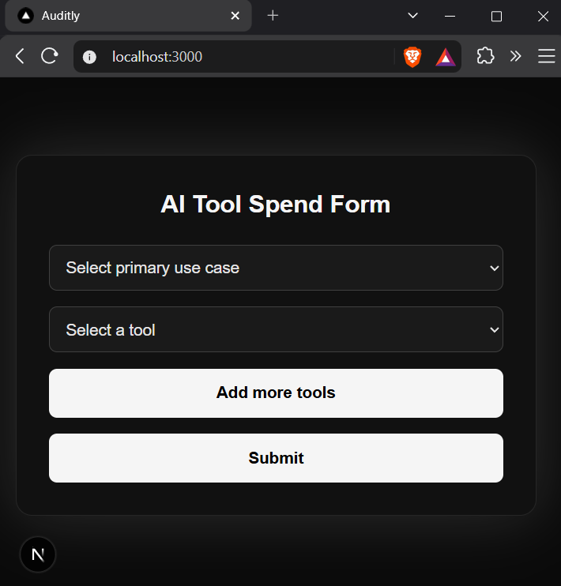
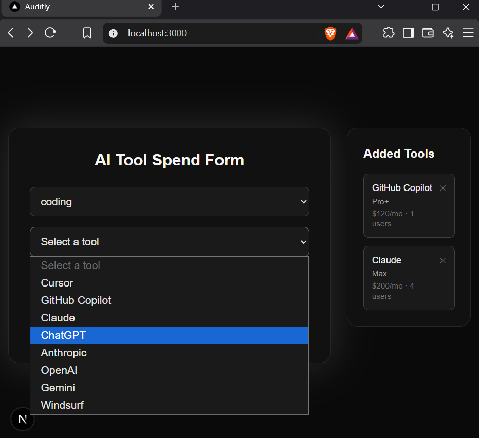
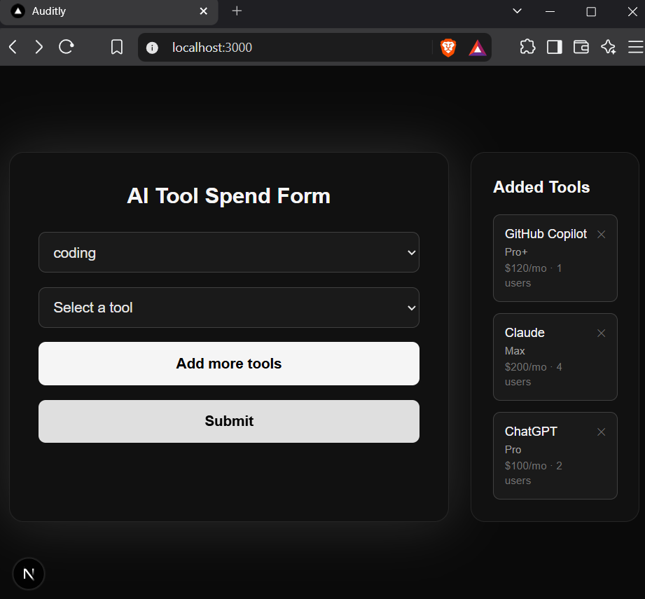
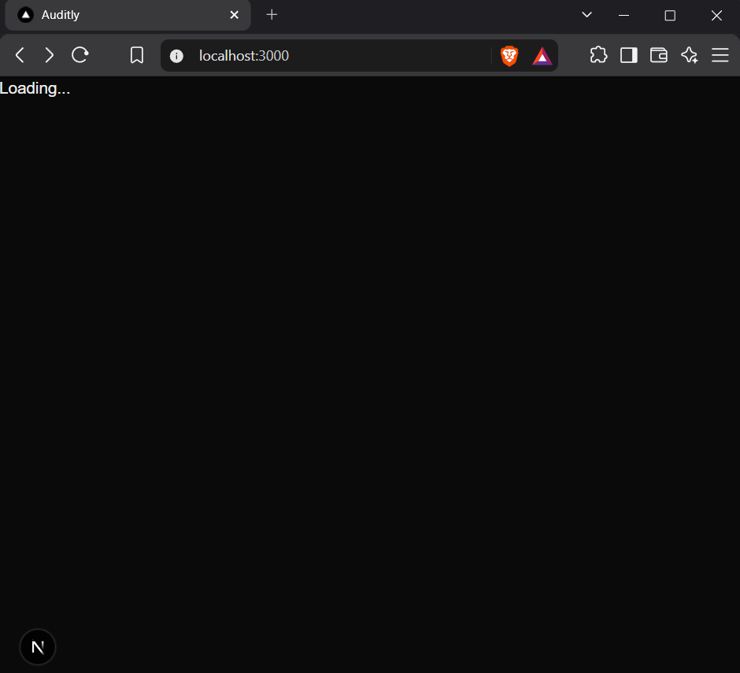
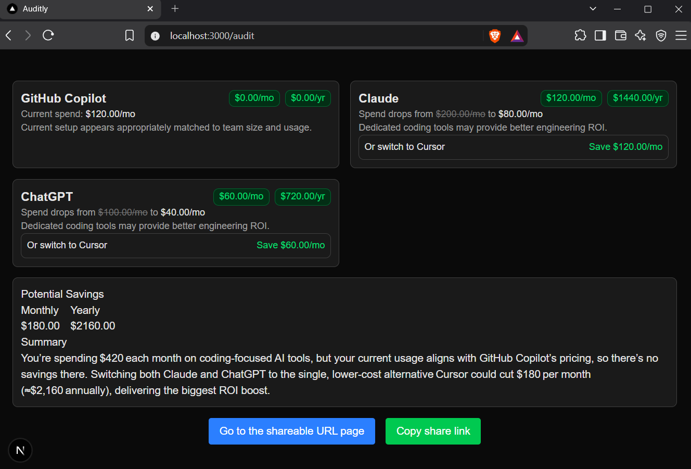

# Auditly


A free web app that helps startups understand and optimize their AI tool spending. It analyzes subscriptions like Cursor, ChatGPT, Claude, Copilot, and API usage, then generates an instant audit with potential savings and smarter plan recommendations.

Open-source AI cost optimization tool built with Next.js, Supabase, and Groq.


## 📑 Table of Contents

- [Live Demo](#-live-demo)
- [Features](#-features)
- [Screenshots](#-screenshots)
- [Why Auditly?](#-why-auditly)
- [How It Works](#-how-it-works)
- [Architecture](#-architecture)
- [Tech Stack](#-tech-stack)
- [Project Structure](#-project-structure)
- [Database Schema](#-database-schema)
- [Setup](#-setup)
- [Environment Variables](#-environment-variables)
- [Running Tests](#-running-tests)
- [Assumptions](#-assumptions)
- [Author](#-author)

## 🌐 Live Demo

[Visit Auditly](https://auditly-tau.vercel.app/)


## ✨ Features

- Analyze AI tool subscriptions and monthly spending
- Recommend cheaper plans and better alternatives
- Estimate monthly and yearly savings
- Generate AI-powered audit summaries using Groq
- Share audit reports with unique URLs
- Store and retrieve audit reports from Supabase


## 📸 Screenshots







## 💡 Why Auditly?

Many teams and developers pay for AI subscriptions they don't fully utilize. Auditly helps identify unnecessary spending and recommends more cost-effective plans in seconds.


## ⚙️ How It Works

1. **Input Collection** — The user enters their AI tools, current plan, team size, monthly spend, and primary use case using a form.

2. **Audit Engine** — Each tool is evaluated individually against a set of rules:
   - Flags over-provisioned plans based on team size (e.g. Enterprise plans for small teams)
   - Suggests alternative tools based on use case (e.g. Cursor for coding-heavy teams, Claude for research)

3. **Savings Calculation** — The engine calculates the cost of the recommended plan or alternative and computes monthly and annual savings.

4. **AI Summary** — The audit result is passed to the Groq API, which generates a plain-English summary of findings.

5. **Shareable Report** — Results are saved and assigned a unique URL so the audit can be revisited or shared.


## 🏗️ Architecture

```text
User
  │
  ▼
Next.js Frontend
  │
  ▼
API Routes
  ├── Audit Engine
  ├── Groq API
  └── Supabase
  │
  ▼
Audit Result
```


## 🛠 Tech Stack
- Framework: Next.js 15 (App Router)
- Language: TypeScript
- UI: React + Tailwind CSS
- Database: Supabase (PostgreSQL)
- AI: Groq API
- Deployment: Vercel


## 📁 Project Structure
```text
Auditly/
├── app/
│   ├── page.tsx                 
│   │
│   ├── audit/
│   │   ├── page.tsx                
│   │   ├── [id]/
│   │   │   └── page.tsx    
│   │        
│   ├── api/
│   │   ├── audit/
│   │   │   └── route.ts           
│   │   ├── lead/
│   │   │   └── route.ts            
│   │   ├── summary/
│   │   │   └── route.ts   
│   │        
│
├── components/
│   ├── forms/
│   │   ├── SpendForm.tsx      
│   │   ├── AddedTools.tsx     
│   │
│   ├── audit/
│   │   ├── AuditCard.tsx           
│   │   ├── AuditSummary.tsx        
│   │
│
├── docs/
│   ├── DEVLOG.md
│   ├── PRICING_DATA.md
│
├── hooks/
│   ├── useAudit.ts                                    
│   ├── useLocalStorage.ts   
│
├── lib/
│   ├── audit/
│   │   ├── engine.ts              
│   │   ├── pricing.ts             
│   │   ├── types.ts  
│   │   ├── constants.ts              
│   │
│   ├── db/
│   │   ├── supabase.ts 
│   │   ├── supabase.types.ts            
│   │
│   ├── ai/
│   │   ├── summary.ts           
│
├── utils/
│   ├── validateInput.ts                               
│
├── screenshots/                                   
│
├── tests/
│   ├── audit.engine.test.ts     
│   ├── validation.test.ts          
│            
│
├── .env.local
├── next.config.ts
├── tsconfig.json
├── package.json
└── README.md
```

## 🗄️ Database Schema

### audits

| Column Name | Data Type | Default Value | Primary Key |
| :--- | :--- | :--- | :---: |
| **id** | `uuid` | `gen_random_uuid()` | ✅ |
| **created_at** | `timestamptz` | `now()` | |
| **primary_use_case** | `text` | `NULL` | |
| **total_monthly_savings** | `numeric` | `NULL` | |
| **total_annual_savings** | `numeric` | `NULL` | |
| **summary** | `text` | `NULL` | |
| **is_high_savings** | `bool` | `NULL` | |
| **cta** | `text` | `NULL` | |

---

### audit_tool_results

| Column Name | Data Type | Default Value | Primary Key | Foreign Key |
| :--- | :--- | :--- | :---: | :--- |
| **id** | `uuid` | `gen_random_uuid()` | ✅ | |
| **created_at** | `timestamptz` | `now()` | | |
| **audit_id** | `uuid` | — | | `public.audits.id` |
| **tool_name** | `text` | `NULL` | | |
| **current_plan** | `text` | `NULL` | | |
| **current_spend** | `numeric` | `NULL` | | |
| **team_size** | `numeric` | `NULL` | | |
| **recommended_plan** | `text` | `NULL` | | |
| **recommended_alt** | `text` | `NULL` | | |
| **monthly_savings** | `numeric` | `NULL` | | |
| **annual_savings** | `numeric` | `NULL` | | |
| **reason** | `text` | `NULL` | | |


## 📦 Setup
```bash
git clone https://github.com/menukahansda/auditly.git
cd auditly
npm install
npm run dev
```
Create a `.env.local` file with the following variables.

## 🔑 Environment Variables
```env
GROQ_API_KEY=your_groq_api_key
NEXT_PUBLIC_SUPABASE_URL=your_supabase_url
SUPABASE_SERVICE_ROLE_KEY=your_supabase_service_role_key
```


## 🧪 Running Tests

```bash
npm test
```

## ⚠️ Assumptions

- Pricing recommendations are based on pricing information available during development.
- Actual subscription pricing may change over time.
- Estimated savings may differ from real billing.


## 👤 Author
Built by [Menuka Hansda](https://github.com/menukahansda)

